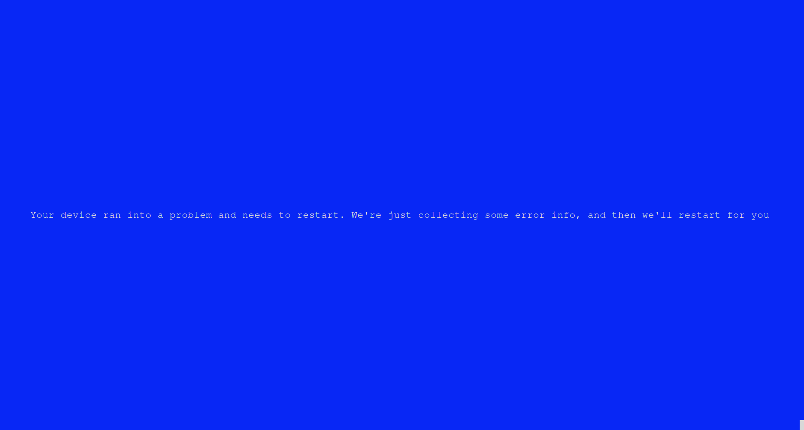

# Blue Screen of Fun 😄

Welcome to **Blue Screen of Fun**, a playful Rust project designed to bring a smile to your face! This project is inspired by the infamous Windows Blue Screen of Death (BSOD), but don't worry—this one is purely for fun and has no harm intended! 😜

## Project Description

This project creates a simple blue screen that mimics the Windows BSOD, but with a funny twist. It's a light-hearted way to prank your friends or just to amuse yourself with some nostalgic error vibes.

## How It Works

The project is built using [Rust](https://www.rust-lang.org/) and managed with [Cargo](https://doc.rust-lang.org/cargo/). It simulates a blue screen using terminal output, and you can customize the text for added fun!

### Features:
- Mimics the appearance of a Windows blue screen
- Customizable error messages to make it your own
- Runs directly in the terminal

## Installation

First, make sure you have Rust installed. You can install Rust and Cargo via [rustup](https://rustup.rs/).

```bash
# Clone the repository
git clone https://github.com/yourusername/blue-screen-of-fun.git

# Go into the project directory
cd blue-screen-of-fun

# Build and run the project
cargo run
```


## Demo

Here's a sneak peek of what the Blue Screen of Fun looks like:


